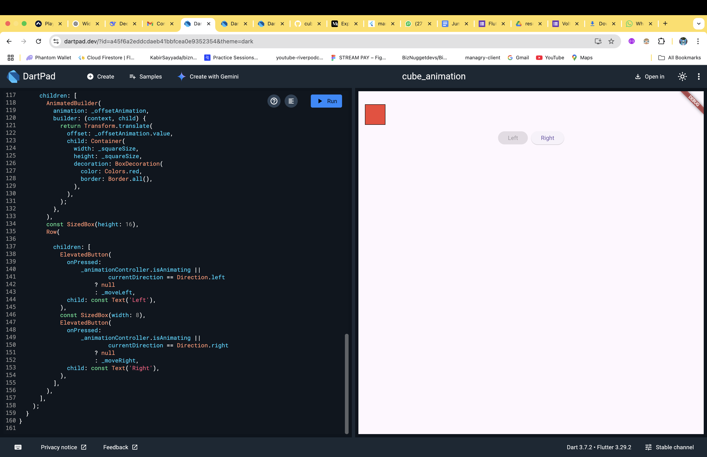

# Cube Animation flutter Test Challenge

An animated Flutter widget that smoothly moves a red square across the screen when the **"Left"** and **"Right"** buttons are pressed.

---

## Task

Create a red square that:
- Starts at the **center** of the screen.

- Moves **left** or **right** when the corresponding buttons are pressed.
- **Animates** the movement over 1 second.
- Disables buttons appropriately based on the current state.

---

## Requirements

1. The square **starts in the center** of the screen.
2. Pressing **"Right"** moves the square to the **right edge**.
3. Pressing **"Left"** moves the square to the **left edge**.
4. **Disable** the "To Right" button when the square is already at the right edge.
5. **Disable** the "To Left" button when the square is already at the left edge.
6. The movement should be **animated** with a **1-second duration**.
7. **Both buttons** should be disabled **during animation** to prevent overlapping transitions.

---

## Screenshot

## Try It Out

- **Live Demo**: [https://manuelalex.github.io/cube_animation_web/](https://manuelalex.github.io/cube_animation_web/)

- **Test on DartPad**: Copy-paste `main.dart` into [https://dartpad.dev/](https://dartpad.dev/) to run it instantly.

---

